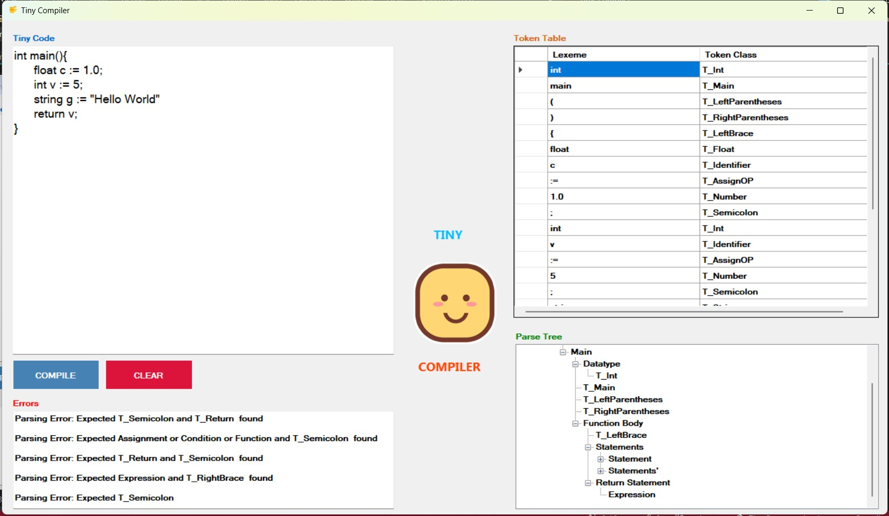

# Tiny Programming Language Compiler 🤏

 An implementation of Scanner and Parser for Tiny programming language, 
 
 Langage's NFA constructed from [Regex](https://en.wikipedia.org/wiki/Regular_expression) using [Thompson Construction method](https://en.wikipedia.org/wiki/Thompson%27s_construction) and converted to DFA using [Subset / Powerset Construction method](https://en.wikipedia.org/wiki/Powerset_construction) and then minimized the DFA

 

## Language syntax and documentation

- [Regex](docs/regex-expressions.md)
- [DFA](docs/dfa.md)
- [CFG](docs/Tiny_Language_CFG_Rules.md)
- [Sample Codes](docs/samples.md)
- Download [NFA Documentation pdf](docs/NFA_using_Thompson_Construction__221129_020353_1.pdf) or [DFA pdf](docs/DFA_and_Regex_for_TINY_language__221129_020437_1_2.pdf)

## Lexer "Scanner"

- Implemented in `Scanner.cs`
- Based on the following [Regular Expressions (Regex)](docs/regex-expressions.md) and [Deterministic Finite Automata (DFA)](docs/dfa.md)
- Scans the code to identify Lexemes
- Produces a list of Tokens
- Checks for unrecognized Tokens and outputs them in errors list

## Parser

- Implemented in `Parser.cs`
- Based on the following [Context Free Grammer (CFG) rules](docs/Tiny_Language_CFG_Rules.md)
- Uses the token stream produced by Scanner to Build an abstract syntax tree
- Checks for syntax errors and outputs them in errors list
